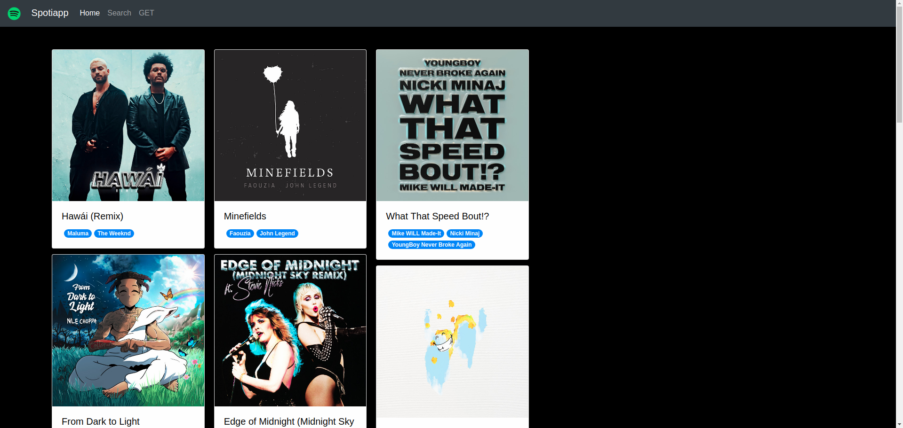
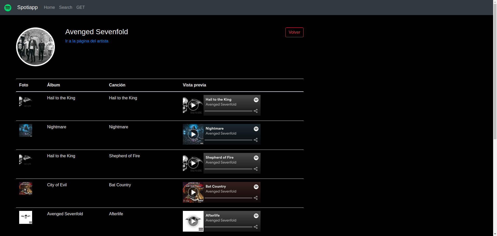

## **04-spotiapp**
---
1. Uso de HttpClientModule para realizar peticiones GET y POST
2. Interacción con la API de Spotify para leer y mostrar datos
3. Widgets de Spotify
4. Manejo de información async
    * Observables + map (rxjs)
5. ngModel

---
