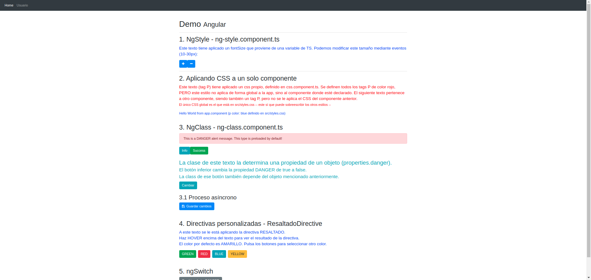
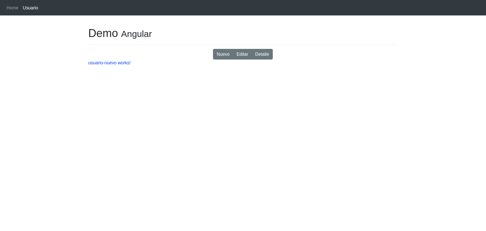

## **06-miscelaneos**
---
1. Cambio de estilos mediante variables declaradas en los componentes
2. Añadir y eliminar clases HTML según condiciones
3. Directivas personalizadas
4. ngSwitch
5. Rutas hijas
5. Ciclo de vida de los componentes y las directivas

