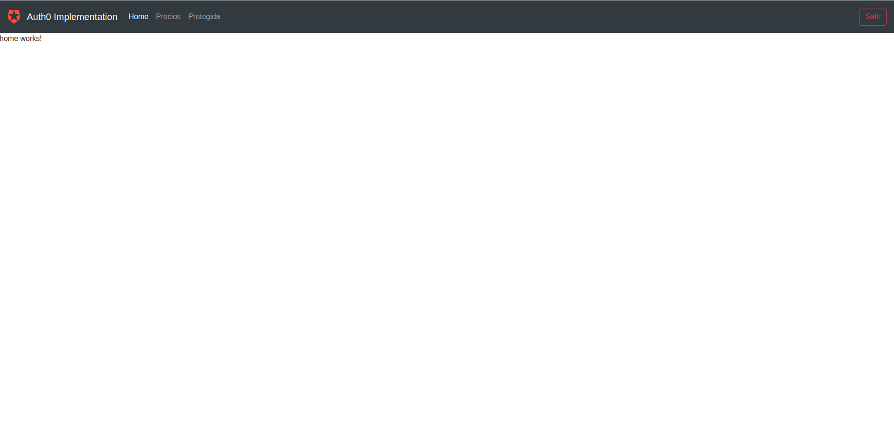

## **07-authapp**
---
1. Introducción y uso de Auth0
2. Autenticación de usuarios con Facebook, Twitter y Google
3. Bloqueo de rutas para usuarios no logueados
    * AuthGuard
4. Obtención de los datos del usuario logueado

