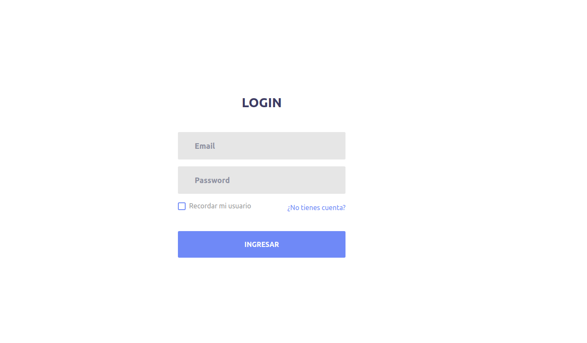

## **07-login-app**
---
Ampliación del proyecto anterior. En este caso, autenticamos contra Firebase.

1. Validación de formularios
2. Firebase REST API
3. Registro y login de usuarios
4. Tokens de acceso
5. Bloqueo de rutas a usuarios no logueados
    * AuthGuard
6. Animaciones CSS
    * animate.css

