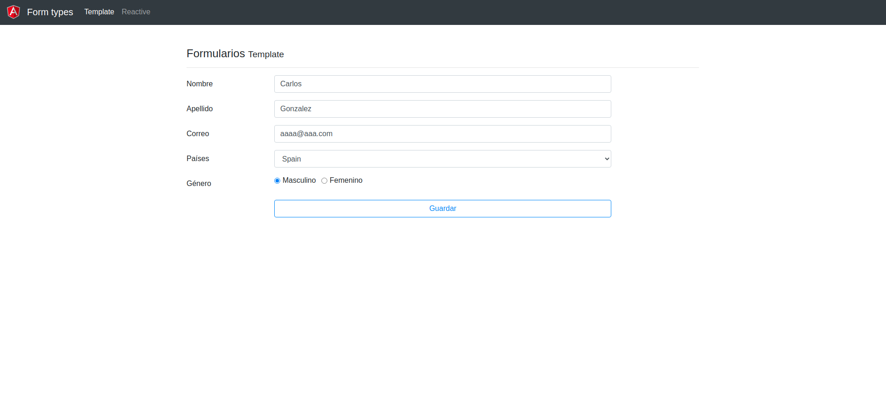
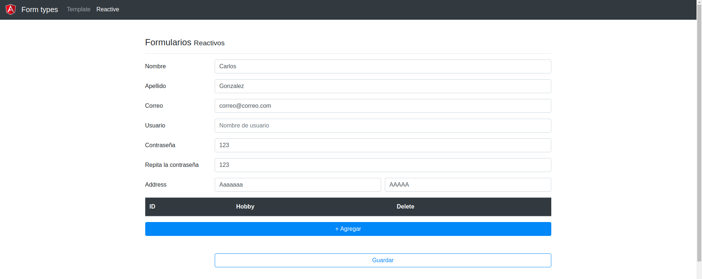

## **08-formularios**
---
1. Uso de formularios por template y reactive
2. Submits con ngSubmit
3. Carga de valores por defecto a los formularios
4. Validaciones
    * Pre-built
    * Personalizadas
    * Asíncronas
5. Listeners en los campos de los formularios

