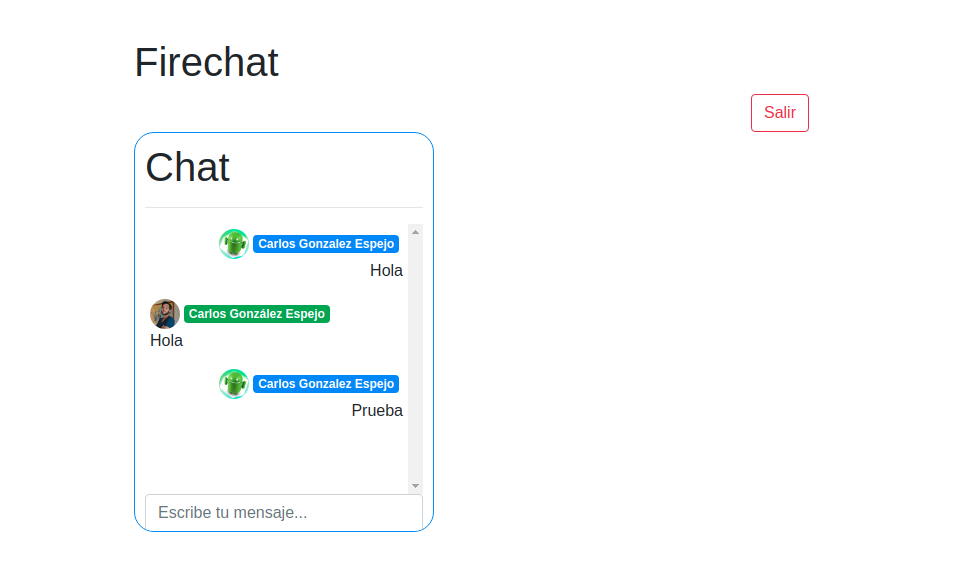

## **10-firechat**
---
Creación de un chat a tiempo real, utilizando Firestore como DB.
1. Uso de la librería AngularFire para la conexión con Firebase
2. Autenticación con Google y Twitter
3. Creación de Observables para escuchar mediante sockets los cambios en Firebase

