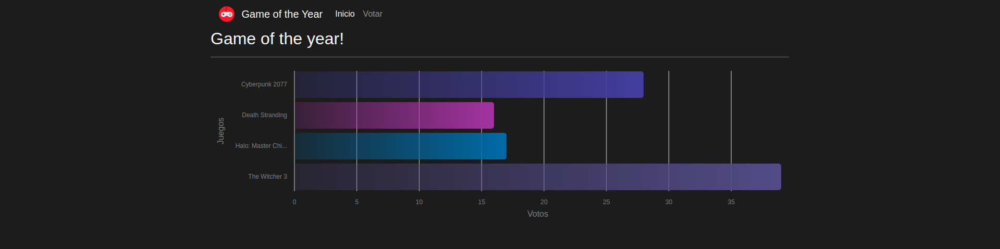

## **17-goty**
---
[ENLACE A LA APLICACIÓN](https://goty-project.web.app/inicio)  
Desarrollo desde **CERO** hasta la puesta en **PRODUCCIÓN** de una web-app.  Se ha desarrollado usando las siguientes tecnologías:

* Angular
* NodeJS
    * Express
* Firebase
    * Firestore Database
    * Firebase Hosting (alojamiento gratuito de la aplicación)
    * ~~Firebase Cloud Functions~~ (requiere Plan Blaze de pago)
* Heroku (despliegue del backend)
    * API REST para obtener y postear data
* Angular CDK
* [AngularFire](https://github.com/angular/angularfire)
* [ngx-charts](https://github.com/swimlane/ngx-charts)
* [SweetAlert2](https://sweetalert2.github.io/)

