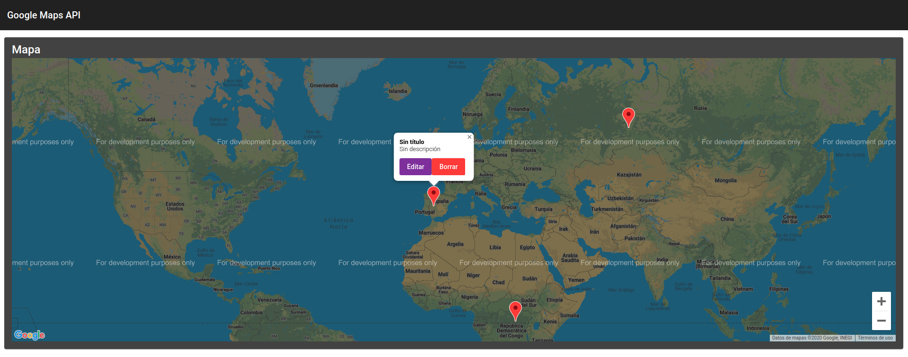
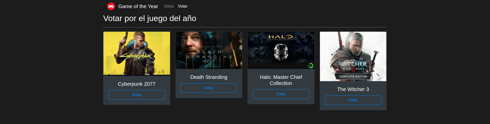

# **ANGULAR COURSE EXAMPLES**
Este repositorio contiene todos los proyectos realizados durante el curso de **Angular10+**. Antes de compilar el código de cada proyecto, es necesario instalar los módulos:
<pre>npm install</pre>
Una vez instalados:
<pre>ng serve [-o]</pre>
El curso realizado es el siguiente: [Curso de Angular10+ - Fernando Herrera](https://www.udemy.com/course/angular-2-fernando-herrera/)
 

## **01-hola-mundo**
---
1. Introducción a los componentes
2. Importación de componentes
3. Primeras directivas de Angular
    * ngIf
    * ngFor
4. Bootstrap 4

## **02-single-page-application**
---
1. Instalación de Bootstrap4 y otras librerías mediante NPM
2. Creación de rutas
3. Uso de Router, RouterLink y RouterLinkActive para navegar entre rutas y asignar clases a elementos activos
5. Obtención de parámetros vía URL
6. Introducción a los servicios
7. Introducción a los pipes
8. Búsqueda de elementos

## **03-pipes**
---
1. Uso de pipes en Angular
    * uppercase | lowecase
    * slice
    * decimal
    * percent
    * currency
    * json
    * async
    * date
2. Creación de pipes personalizados
    * capitalize
    * domseguro

## **04-spotiapp**
---
1. Uso de HttpClientModule para realizar peticiones GET y POST
2. Interacción con la API de Spotify para leer y mostrar datos
3. Widgets de Spotify
4. Manejo de información async
    * Observables + map (rxjs)
5. ngModel

---

## **05-wishlist**
---
Aplicación móvil diseñada con el framework de **Ionic**.
1. Uso de localStorage para almacenar información
2. CRUD sencillo para manejar la información
2. Introducción al framework de Ionic
3. Impure pipes

## **06-miscelaneos**
---
1. Cambio de estilos mediante variables declaradas en los componentes
2. Añadir y eliminar clases HTML según condiciones
3. Directivas personalizadas
4. ngSwitch
5. Rutas hijas
5. Ciclo de vida de los componentes y las directivas

## **07-authapp**
---
1. Introducción y uso de Auth0
2. Autenticación de usuarios con Facebook, Twitter y Google
3. Bloqueo de rutas para usuarios no logueados
    * AuthGuard
4. Obtención de los datos del usuario logueado

## **07-login-app**
---
Ampliación del proyecto anterior. En este caso, autenticamos contra Firebase.

1. Validación de formularios
2. Firebase REST API
3. Registro y login de usuarios
4. Tokens de acceso
5. Bloqueo de rutas a usuarios no logueados
    * AuthGuard
6. Animaciones CSS
    * animate.css

## **08-formularios**
---
1. Uso de formularios por template y reactive
2. Submits con ngSubmit
3. Carga de valores por defecto a los formularios
4. Validaciones
    * Pre-built
    * Personalizadas
    * Asíncronas
5. Listeners en los campos de los formularios

## **09-heroesApp**
---
1. CRUD en Firebase
    * GET
    * POST
    * DELETE
    * PUT
2. Importación de SweetAlert2

## **10-firechat**
---
Creación de un chat a tiempo real, utilizando Firestore como DB.
1. Uso de la librería AngularFire para la conexión con Firebase
2. Autenticación con Google y Twitter
3. Creación de Observables para escuchar mediante sockets los cambios en Firebase

## **11-peliculasApp**
---
1. Estructura de proyecto real
2. Conexión a la API de TMDB
3. Slideshow
4. Swiper
5. Star-rating package
6. Buscador de películas 
7. Infinite scroll
8. Operadores RXJS
    * tap
    * map

## **12-maps-google**
---
1. Conexión a la API de Google Maps
2. Reactive forms
3. Eventos e interacciones con los mapas de Google
4. Edición de marcadores
5. Implementación de Angular Material

## **13-youtube-app**
---
1. Conexión a la API de YouTube (v3)
2. Peticiones GET a la API para mostrar los vídeos de un canal
3. SweetAlert2
4. Interfaces

## **14-fotosFirebase**
---
1. Librería AngularFire
    * Storage
    * Firestore Documents
2. Subida de ficheros (imágenes) al storage + escritura en BD
    * Drag and drop
    * Directiva custom
    * Callbacks de la subida
3. Render de todas las imagenes almacenadas en el storage

## **15-graphs**
---
Implementación de gráficos con las librerías:
* <code>[chart.js](https://www.chartjs.org/)</code>
* <code>[ng2-charts](https://valor-software.com/ng2-charts/)</code>

## **16-virtual-scroll-drag-drop**
---
Implementación de nuevas funcionalidades de la versión 7 de Angular:
* Angular CDK (Component Development Kit) --> Angular Material
* Virtual scroll
* Drag and drop

Instalar el siguiente paquete:
<pre>npm install @angular/cdk</pre>

El concepto es similar al de los RecyclerView de Android: renderiza dinámicamente **SOLO** lo que esté dentro del viewport más un offset.

## **17-goty**
---
[ENLACE A LA APLICACIÓN](https://goty-project.web.app/inicio)  
Desarrollo desde **CERO** hasta la puesta en **PRODUCCIÓN** de una web-app.  Se ha desarrollado usando las siguientes tecnologías:

* Angular
* NodeJS
    * Express
* Firebase
    * Firestore Database
    * Firebase Hosting (alojamiento gratuito de la aplicación)
    * ~~Firebase Cloud Functions~~ (requiere Plan Blaze de pago)
* Heroku (despliegue del backend)
    * API REST para obtener y postear data
* Angular CDK
* [AngularFire](https://github.com/angular/angularfire)
* [ngx-charts](https://github.com/swimlane/ngx-charts)
* [SweetAlert2](https://sweetalert2.github.io/)

## **17-goty-backend-v2**
---
Backend utilizado para el proyecto 17. Realizado utilizando NodeJS y Express.  
Desplegado en Heroku para escuchar peticiones GET y POST.